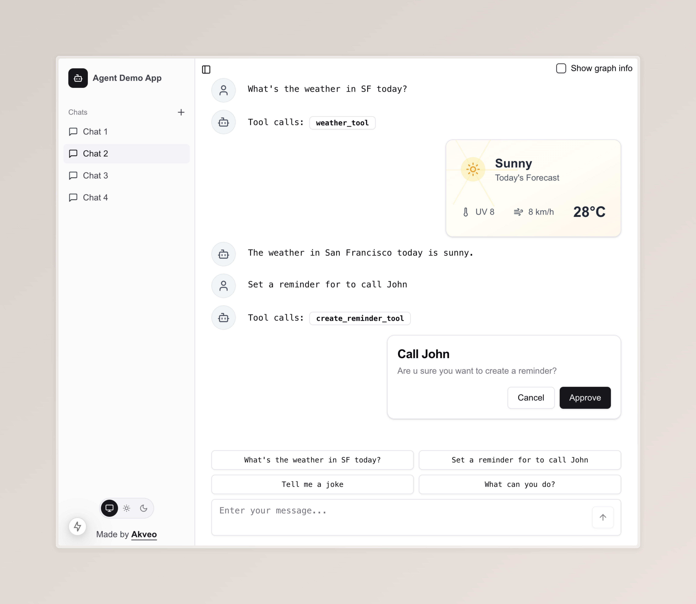

# AI cookbook

This repository contains a set of use cases demonstrating how to build AI-featured applications.
- [LangGraph + Next.js](#langgraph--nextjs)
- [MCP (Model Context Protocol)](#mcp-model-context-protocol)

# LangGraph + Next.js
This demo shows how to create a simple AI agent using LangGraph and integrate it into a Next.js application. [LangGraph](https://langchain-ai.github.io/langgraph/) is a robust framework for building agent and multi-agent workflows. It provides flexibility to build complex logic and has great tooling for debugging (LangGraph Studio) and monitoring (LangSmith). [Next.js](https://nextjs.org/) is a popular framework for building web applications.

The demo includes the following capabilities:
### Capabilities
- <b>Streaming</b>. Agent streams LLM tokens to the client application.
- <b>Generative UI</b>. Renders components based on agent state. For example, weather widget.
- <b>Human in the loop</b>. Agent can ask users for clarification to proceed with tasks. For example, reminder creation confirmation.
- <b>Persistence</b>. LangGraph has a built-in persistence layer. It can be used to persist agent state between sessions. In the demo app, state is persisted in memory. See [LangGraph Persistence](https://langchain-ai.github.io/langgraph/how-tos/#persistence) for how to use PostgreSQL or MongoDB.
- <b>Reply and Fork</b>. Agent can be replied to or forked from any checkpoint.
- <b>Agent state replication</b>. Agent state is fully replicated on the client side based on the graph checkpoints.
- <b>Error handling</b>. The app displays global agent errors, such as when an agent is not accessible, as well as errors that occur at the graph node level.
- <b>Stop agent</b>. Agent execution can be stopped and resumed later.
- <b>No dependencies</b>. There are no dependencies on third-party libraries for integration. You can adjust it to your needs.
- <b>Clean UI</b>. The app is based on [shadcn](https://ui.shadcn.com/) components and has dark and light theme support.

### Limitations
There are some features that are not implemented yet:
- Graph interruption (Human in the loop) in parallel nodes.
- Send custom events from the same parallel nodes. E.g., when checking weather for multiple cities at the same time, it is not possible to distinguish between them on the client side.



# MCP (Model Context Protocol)
This demo shows how to create and use the [Model Context Protocol (MCP)](https://github.com/modelcontextprotocol) in your application. The Model Context Protocol is a method for integrating external data sources or services into your LLM application. The demo includes the following:
- TypeScript and Python MCP servers implementations
- `STDIO` and `SSE` transport protocols
- Integraion MCP servers with LangGraph servers

# Starter kit
You can use this project as the starting point for your projects:
- Clone the repository
- Adjust the AI agent logic in the [`graph.py`](/agent/app/agent/graph.py) file or create a brand new one
- Adjust the agent state in the [`agent-types.ts`](/client/app/chat/[id]/agent-types.ts) file
- In the client app, call agent using [`useLangGraphAgent`](/client/hooks/useLangGraphAgent/useLangGraphAgent.tsx) hook in your components

# How to run examples
Add .env file to the [`/agent`](/agent) directory and set your OPENAI_API_KEY (See [`.env.example`](/agent/.env.example))

## LangGraph server
```bash
cd agent/
poetry install
poetry run server
```
### MCP Servers
To run the AI server with MCP tools using the `SSE` protocol, first start the MCP servers. MCP servers using the `STDIO` protocol run automatically.
- Start Booking MCP demo server
```bash
cd mcp-servers/booking-mcp
bun install
npm start
```
- Start Calendar MCP demo server
```bash
cd mcp-servers/calandar-mcp
uv sync
uv run python calendar-mcp-server.py sse
```
- Edit MCP servers confuguration in [graph.py](/agent/app/agent/graph.py)
- Run agent server with `--mcp` flag
```bash
cd agent/
poetry install
poetry run server --mcp
```

## Next.js client
```bash
cd client/
npm install
npm run dev
```
Application will start at http://localhost:3000 by default

# Building AI-powered apps?
Get expert support with [`Akveo's AI development services`](https://www.akveo.com/services/ai-development-services).
